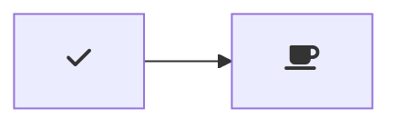

Clock should have a mechanism to set and store the current time. >

Clock should have a mechanism to set and store an alarm time. >

Clock should sound a buzzer at the set alarm time if enabled. >

Clock should have a mechanism to stop the buzzer if alarm was triggered.

Response Time: The system shall provide a response time of less than 2 seconds for user interactions in normal operational conditions. This requirement ensures a responsive and smooth user experience, enhancing user satisfaction and engagement

Response Time:g The system shall provide a response time of less than 2 seconds for user interactions in normal operational conditions. This requirement ensures a responsive and smooth user experience, enhancing user satisfaction and engagement

The system must support a minimum data throughput of 1000 requests per minute during peak load without compromising the response time. This requirement is critical to ensure that the application can handle high traffic volumes without performance bottlenecks d

The system must support a minimum data throughput of 1000 requests per minute during peak load without compromising the response time. This requirement is critical to ensure that the application can handle high traffic volumes without performance bottlenecks d

User Data Privacy: The product must comply with relevant data protection regulations (e.g., GDPR, HIPAA) and ensure that user data is securely stored and processed. All sensitive user information, including personal details and payment information, must be encrypted and protected from unauthorized access.
The system must support a minimum data throughput of 1000 requests per minute during peak load without compromising the response time. This requirement is critical to ensure that the application can handle high traffic volumes without performance bottlenecks d

Authentication and Authorization: Implement a robust user authentication and authorization system to ensure that only authorized users can access certain features or data within the application.

Secure Communication: All data exchanged between the product and external systems or users must be transmitted over secure and encrypted channels, such as HTTPS, to prevent eavesdropping or data tampering

Maintainability:

Code Quality: The development team will adhere to coding standards, and the codebase shall have a minimum Maintainability Index score of 80, as calculated by a static code analysis tool like SonarQube.
Documentation: All code changes shall be accompanied by comprehensive documentation, and the codebase shall have no more than 2% documented issues or unclear comments.
Test Coverage: Unit test coverage shall be maintained at a minimum of 90%, and integration test coverage shall be at least 80% to facilitate future updates and changes.
Modular Design: The software architecture shall be modular, following best practices, and changes or feature additions should require minimal modifications to existing code, as outlined in design patterns and modularity guidelines.

Maintainability:

Code Quality: All code written will adhere to industry best standards, and therefore clear and concise, allowing future developers to easily get up to speed with the codebase.

Documentation: All code changes shall be accompanied by comprehensive documentation.
Test Coverage: Unit test coverage shall be maintained at a minimum of 90%, and integration test coverage shall be at least 80% to facilitate future updates and changes.
Modular Design: The software architecture shall be modular, following best practices, and changes or feature additions should require minimal modifications to existing code, as outlined in design patterns and modularity guidelines.

The software will operate on mobile devices, including smartphones running Android 8 and above (as of 2022) and iOS 13 or later. It should also be compatible with common mobile web browsers, interact with backend services, databases, and APIs, and integrate with third-party services and libraries. Compatibility with mobile security software, such as antivirus and anti-malware apps, is essential to ensure peaceful coexistence, and thorough testing across various device configurations is necessary to ensure a seamless user experience

The software will operate on mobile devices, including smartphones running Android 8 and above (as of 2022) and iOS 13 or later. It should also be compatible with common mobile web browsers, interact with backend services, databases, and APIs, and integrate with third-party services and libraries. Compatibility with mobile security software, such as antivirus and anti-malware apps, is essential to ensure peaceful coexistence, and thorough testing across various device configurations is necessary to ensure a seamless user experience
The software will operate on mobile devices, including smartphones running Android 8 and above (as of 2022) and iOS 13 or later. It should also be compatible with common mobile web browsers, interact with backend services, databases, and APIs, and integrate with third-party services and libraries. Compatibility with mobile security software, such as antivirus and anti-malware apps, is essential to ensure peaceful coexistence, and thorough testing across various device configurations is necessary to ensure a seamless user experience

Learning Curve for Dart and Flutter

The adoption of Dart and Flutter as the development framework for the project introduces a significant constraint in the form of a learning curve for the development team. Dart, being a less commonly used programming language compared to some others, and Flutter, a relatively new framework, may require developers to invest time in acquiring proficiency and familiarity. This constraint implies that resources will need to be allocated for training and skill acquisition, which could impact the project timeline. Developers may initially face challenges in adapting to the new technology stack, potentially affecting the pace of development. As a result, the team will need to carefully manage this constraint by planning for adequate training and skill development while ensuring that it doesn't hinder project progress or compromise the quality of the final product.
The adoption of Dart and Flutter as the development framework for the project introduces a significant constraint in the form of a learning curve for the development team. Dart, being a less commonly used programming language compared to some others, and Flutter, a relatively new framework, may require developers to invest time in acquiring proficiency and familiarity. This constraint implies that resources will need to be allocated for training and skill acquisition, which could impact the project timeline. Developers may initially face challenges in adapting to the new technology stack, potentially affecting the pace of development. As a result, the team will need to carefully manage this constraint by planning for adequate training and skill development while ensuring that it doesn't hinder project progress or compromise the quality of the final product.

User Authentication and Authorization
Data Encryption
Secure File Uploads
User Privacy and Data Protection

**Hello**

```python
for i in range(10):
	print(i)
```




```flowchart
	st=>start: Start:>http://www.google.com[blank]
e=>end:>http://www.google.com
op1=>operation: My Operation
sub1=>subroutine: My Subroutine
cond=>condition: Yes
or No?:>http://www.google.com
io=>inputoutput: catch something...
para=>parallel: parallel tasks

st->op1->cond
cond(yes)->io->e
cond(no)->para
para(path1, bottom)->sub1(right)->op1
para(path2, top)->op1
```


```

```
